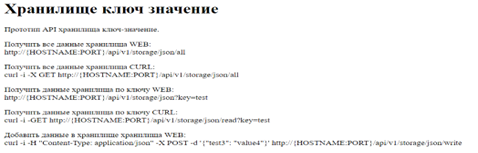
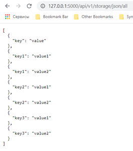
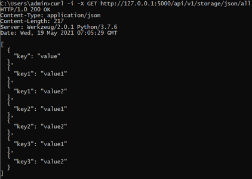
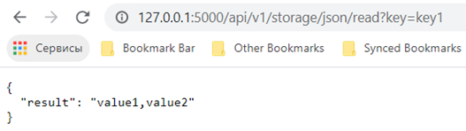
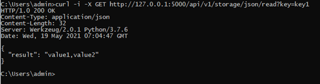
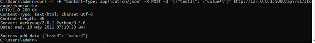

# Тестовые задания

## Подготовка к выполнению

1. Установить VirtualBox (или VMware workstation player)
2. Разобраться как создать виртуальную машину 
3. Создать новую vm на базе дистрибутива Centos (Centos это параллельная open source ветка rhel)
4. Подключиться к созданной vm по ssh через любой клиент
5. Установить Python на созданной vm

## Задание 1.1

В домашней директорий пользователя создать папку task. 
Реализовать собственное key-values хранилище на Python. 
Данные будут сохраняться в файле storage.data(в формате JSON, можно использовать библиотеку tempfile, для хранения данных во временных файлах). 
Добавление новых данных в хранилище и получение текущих значений осуществляется с помощью утилиты командной строки storage.py. 

Пример работы утилиты: 

```bash 
Сохранение данных
$ storage.py --key key_name --val value
Получение данных
$ storage.py --key key_name
```

Обратите внимание, что значения по одному ключу не перезаписываются, а добавляются к уже сохраненным. 
Другими словами - по одному ключу могут храниться несколько значений. 
При выводе на печать, значения выводятся в порядке их добавления в хранилище (Пример ввода "test_value,test_value2,test_value3" ).
Формат вывода на печать для нескольких значений через запятую. Если значений по ключу не было найдено, выведите пустую строку или None.
Сделать обработку исключений, если они будут возникать при тестировании. Скрипт должен работать в разных ОС.

## Решение задания 1.1

## Задание 1.2 (усложненное)

Написать сервис API на Python к key-values хранилищу из задания 
Самый простой фреймворк для реализации flask и дополнительный модуль flaskRESTful. 
Хранить данные можно так же во временных файлах в файле storage.data(в формате JSON, можно использовать библиотеку tempfile).
Сервис должен уметь отвечать на запросы POST и GET. Требования к выводу можно взять из задания 1. 
Ниже в скриншотах есть демонстрация основных запросов и их вывода. 
На главной странице сервиса ‘/’ сделать описание возможностей сервиса API.



Пример запросов сервису:
Получить все данные хранилища WEB:
http://{HOSTNAME:PORT}/api/v1/storage/json/all



Получить все данные хранилища CURL:

```bash
curl -i -X GET http://{HOSTNAME:PORT}/api/v1/storage/json/all
```


Получить данные хранилища по ключу WEB:
http://{HOSTNAME:PORT}/api/v1/storage/json?key=test



Получить данные хранилища по ключу CURL:
curl -i -GET http://{HOSTNAME:PORT}/api/v1/storage/json/read?key=test



Добавить данные в хранилище хранилища WEB:

```bash
curl -i -H "Content-Type: application/json" -X POST -d '{"test3": "value4"}' http://{HOSTNAME:PORT}/api/v1/storage/json/write
```



Из сервиса сделать новый Docker Image и запустит контейнер, данные хранить внутри контейнера, при перезапуске будут отчищается

## Решение задания 1.2

---

## Задание 2.1

Создать 2 WEB сервера с выводом страницы «Hello Word! \n Server 1» (аналогично для второго Server 2).
Сделать балансировку нагрузки (HA + keepalived), чтобы при обновлении страницы мы попадали на любой из WEB серверов.
Для балансировки можно сделать 2 отдельных сервера, в сумме 4.
Будет плюсом использование Docker.

## Решение задания 2.1

## Задание 2.2 (усложненное)

Написать роль на Ansible по развёртыванию стенда из Задание 2.1. 
Должен быть описан файл инвентори с серверами по примеру:

```bash
[loadbalancers]
ha1 ansible_host=10.10.1.1
ha2 ansible_host=10.10.1.2
[webservers]
web1 ansible_host=10.10.1.1
web2 ansible_host=10.10.1.2
```

Можно написать 1 большую роль, либо 3 роли и потом вызвать их поочёрдно.
Роль Nginx – устанавливает и конфигурирует Nginx на группе хостов [webservers].
Роль HA Proxy – устанавливает и конфигурирует HA Proxy на группе хостов [loadbalancers].
Роль Keepalived – устанавливает и конфигурирует Keepalived на группе хостов [loadbalancers].
Конфиги nginx, HA proxy, keepalived оформить, используя шаблоны Jinja2(язык шаблонов).
Пример использования шаблонов Jinja2:
В каталоге /roles/nginx/templates создаётся конфиг nginx.conf, далее в роле мы используем данный конфиг

```bash
- name: Add nginx config
	  template:
	     src=template/nginx.conf
     dest=/etc/nginx/nginx.conf
```

Итоговый playbook объединяющий три роли может выглядеть следующим образом.

```bash
- hosts: webservers
become: yes
roles:
- nginx
- hosts: loadbalancers
become: yes
roles:
- ha-proxy
- hosts: loadbalancers
become: yes
roles:
- keepalived
Запуск итогового playbook примерно выглядит так
Ansible-playbook –i <inventory_file>  nginx_haproxy_ha.yml
```

## Решение задания 2.1

---

### Ссылки

Ссылка на VirtualBox: https://www.virtualbox.org/wiki/Downloads	
Ссылка на VMware workstation player: https://www.vmware.com/ru/products/workstation-player/workstation-player-evaluation.html
Ссылка на Centos: https://www.centos.org/download/

---