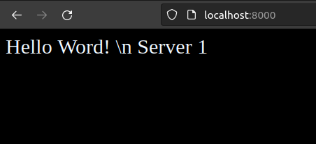
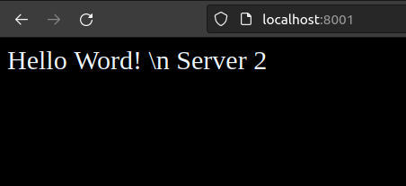

# Тестовые задания

## Подготовка к выполнению

1. Установить VirtualBox (или VMware workstation player)
2. Разобраться как создать виртуальную машину 
3. Создать новую vm на базе дистрибутива Centos (Centos это параллельная open source ветка rhel)
4. Подключиться к созданной vm по ssh через любой клиент
5. Установить Python на созданной vm

## Задание 1.1

В домашней директорий пользователя создать папку task. 
Реализовать собственное key-values хранилище на Python. 
Данные будут сохраняться в файле storage.data(в формате JSON, можно использовать библиотеку tempfile, для хранения данных во временных файлах). 
Добавление новых данных в хранилище и получение текущих значений осуществляется с помощью утилиты командной строки storage.py. 

Пример работы утилиты: 

```bash 
Сохранение данных
$ storage.py --key key_name --val value
Получение данных
$ storage.py --key key_name
```

Обратите внимание, что значения по одному ключу не перезаписываются, а добавляются к уже сохраненным. 
Другими словами - по одному ключу могут храниться несколько значений. 
При выводе на печать, значения выводятся в порядке их добавления в хранилище (Пример ввода "test_value,test_value2,test_value3" ).
Формат вывода на печать для нескольких значений через запятую. Если значений по ключу не было найдено, выведите пустую строку или None.
Сделать обработку исключений, если они будут возникать при тестировании. Скрипт должен работать в разных ОС.

## Решение задания 1.1

1. Версия Centos + просмотр версии ядра Linux

```bash 
[sid@centos ~]$ cat /etc/centos-release
CentOS Linux release 7.9.2009 (Core)
[sid@centos ~]$ uname -r
3.10.0-1160.66.1.el7.x86_64
```

2. Текущая версия Python

```bash 
[sid@centos ~]$ python -V
Python 2.7.5

[sid@centos ~]$ python3 --version
-bash: python3: command not found
```

3. Устанавливаем версию Python 3.6.8 из репозитория Epel

```bash 
[sid@centos ~]$ sudo yum install epel-release
Loaded plugins: fastestmirror
Determining fastest mirrors
 * base: mirror.yandex.ru
 * extras: mirror.yandex.ru
 * updates: mirror.yandex.ru
base                                                     | 3.6 kB     00:00
extras                                                   | 2.9 kB     00:00
updates                                                  | 2.9 kB     00:00
updates/7/x86_64/primary_db                                |  16 MB   00:00
Resolving Dependencies
--> Running transaction check
---> Package epel-release.noarch 0:7-11 will be installed
--> Finished Dependency Resolution

Dependencies Resolved

================================================================================
 Package                Arch             Version         Repository        Size
================================================================================
Installing:
 epel-release           noarch           7-11            extras            15 k

Transaction Summary
================================================================================
Install  1 Package

Total download size: 15 k
Installed size: 24 k
Is this ok [y/d/N]: y
Downloading packages:
epel-release-7-11.noarch.rpm                               |  15 kB   00:00
Running transaction check
Running transaction test
Transaction test succeeded
Running transaction
  Installing : epel-release-7-11.noarch                                     1/1
  Verifying  : epel-release-7-11.noarch                                     1/1

Installed:
  epel-release.noarch 0:7-11

Complete!

[sid@centos ~]$ sudo yum install python3 python3-devel python3-pip
Loaded plugins: fastestmirror
Loading mirror speeds from cached hostfile
epel/x86_64/metalink                                                                                                                                                                       |  19 kB  00:00:00
 * base: mirror.yandex.ru
 * epel: mirror.yandex.ru
 * extras: mirror.yandex.ru
 * updates: mirror.yandex.ru
epel                                                                                                                                                                                       | 4.7 kB  00:00:00
(1/3): epel/x86_64/group_gz                                                                                                                                                                |  97 kB  00:00:00
(2/3): epel/x86_64/updateinfo                                                                                                                                                              | 1.1 MB  00:00:00
(3/3): epel/x86_64/primary_db                                                                                                                                                              | 7.0 MB  00:00:00
Resolving Dependencies
--> Running transaction check
---> Package python3.x86_64 0:3.6.8-18.el7 will be installed
--> Processing Dependency: python3-libs(x86-64) = 3.6.8-18.el7 for package: python3-3.6.8-18.el7.x86_64
--> Processing Dependency: python3-setuptools for package: python3-3.6.8-18.el7.x86_64
--> Processing Dependency: libpython3.6m.so.1.0()(64bit) for package: python3-3.6.8-18.el7.x86_64
---> Package python3-devel.x86_64 0:3.6.8-18.el7 will be installed
--> Processing Dependency: redhat-rpm-config for package: python3-devel-3.6.8-18.el7.x86_64
--> Processing Dependency: python3-rpm-macros for package: python3-devel-3.6.8-18.el7.x86_64
--> Processing Dependency: python3-rpm-generators for package: python3-devel-3.6.8-18.el7.x86_64
--> Processing Dependency: python-rpm-macros for package: python3-devel-3.6.8-18.el7.x86_64
---> Package python3-pip.noarch 0:9.0.3-8.el7 will be installed
--> Running transaction check
---> Package python-rpm-macros.noarch 0:3-34.el7 will be installed
--> Processing Dependency: python-srpm-macros for package: python-rpm-macros-3-34.el7.noarch
---> Package python3-libs.x86_64 0:3.6.8-18.el7 will be installed
---> Package python3-rpm-generators.noarch 0:6-2.el7 will be installed
---> Package python3-rpm-macros.noarch 0:3-34.el7 will be installed
---> Package python3-setuptools.noarch 0:39.2.0-10.el7 will be installed
---> Package redhat-rpm-config.noarch 0:9.1.0-88.el7.centos will be installed
--> Processing Dependency: dwz >= 0.4 for package: redhat-rpm-config-9.1.0-88.el7.centos.noarch
--> Processing Dependency: zip for package: redhat-rpm-config-9.1.0-88.el7.centos.noarch
--> Processing Dependency: perl-srpm-macros for package: redhat-rpm-config-9.1.0-88.el7.centos.noarch
--> Processing Dependency: perl(Getopt::Long) for package: redhat-rpm-config-9.1.0-88.el7.centos.noarch
--> Processing Dependency: /usr/bin/perl for package: redhat-rpm-config-9.1.0-88.el7.centos.noarch
--> Running transaction check
---> Package dwz.x86_64 0:0.11-3.el7 will be installed
---> Package perl.x86_64 4:5.16.3-299.el7_9 will be installed
--> Processing Dependency: perl-libs = 4:5.16.3-299.el7_9 for package: 4:perl-5.16.3-299.el7_9.x86_64
--> Processing Dependency: perl(Socket) >= 1.3 for package: 4:perl-5.16.3-299.el7_9.x86_64
--> Processing Dependency: perl(Scalar::Util) >= 1.10 for package: 4:perl-5.16.3-299.el7_9.x86_64
--> Processing Dependency: perl-macros for package: 4:perl-5.16.3-299.el7_9.x86_64
--> Processing Dependency: perl-libs for package: 4:perl-5.16.3-299.el7_9.x86_64
--> Processing Dependency: perl(threads::shared) for package: 4:perl-5.16.3-299.el7_9.x86_64
--> Processing Dependency: perl(threads) for package: 4:perl-5.16.3-299.el7_9.x86_64
--> Processing Dependency: perl(constant) for package: 4:perl-5.16.3-299.el7_9.x86_64
--> Processing Dependency: perl(Time::Local) for package: 4:perl-5.16.3-299.el7_9.x86_64
--> Processing Dependency: perl(Time::HiRes) for package: 4:perl-5.16.3-299.el7_9.x86_64
--> Processing Dependency: perl(Storable) for package: 4:perl-5.16.3-299.el7_9.x86_64
--> Processing Dependency: perl(Socket) for package: 4:perl-5.16.3-299.el7_9.x86_64
--> Processing Dependency: perl(Scalar::Util) for package: 4:perl-5.16.3-299.el7_9.x86_64
--> Processing Dependency: perl(Pod::Simple::XHTML) for package: 4:perl-5.16.3-299.el7_9.x86_64
--> Processing Dependency: perl(Pod::Simple::Search) for package: 4:perl-5.16.3-299.el7_9.x86_64
--> Processing Dependency: perl(Filter::Util::Call) for package: 4:perl-5.16.3-299.el7_9.x86_64
--> Processing Dependency: perl(File::Temp) for package: 4:perl-5.16.3-299.el7_9.x86_64
--> Processing Dependency: perl(File::Spec::Unix) for package: 4:perl-5.16.3-299.el7_9.x86_64
--> Processing Dependency: perl(File::Spec::Functions) for package: 4:perl-5.16.3-299.el7_9.x86_64
--> Processing Dependency: perl(File::Spec) for package: 4:perl-5.16.3-299.el7_9.x86_64
--> Processing Dependency: perl(File::Path) for package: 4:perl-5.16.3-299.el7_9.x86_64
--> Processing Dependency: perl(Exporter) for package: 4:perl-5.16.3-299.el7_9.x86_64
--> Processing Dependency: perl(Cwd) for package: 4:perl-5.16.3-299.el7_9.x86_64
--> Processing Dependency: perl(Carp) for package: 4:perl-5.16.3-299.el7_9.x86_64
--> Processing Dependency: libperl.so()(64bit) for package: 4:perl-5.16.3-299.el7_9.x86_64
---> Package perl-Getopt-Long.noarch 0:2.40-3.el7 will be installed
--> Processing Dependency: perl(Pod::Usage) >= 1.14 for package: perl-Getopt-Long-2.40-3.el7.noarch
--> Processing Dependency: perl(Text::ParseWords) for package: perl-Getopt-Long-2.40-3.el7.noarch
---> Package perl-srpm-macros.noarch 0:1-8.el7 will be installed
---> Package python-srpm-macros.noarch 0:3-34.el7 will be installed
---> Package zip.x86_64 0:3.0-11.el7 will be installed
--> Running transaction check
---> Package perl-Carp.noarch 0:1.26-244.el7 will be installed
---> Package perl-Exporter.noarch 0:5.68-3.el7 will be installed
---> Package perl-File-Path.noarch 0:2.09-2.el7 will be installed
---> Package perl-File-Temp.noarch 0:0.23.01-3.el7 will be installed
---> Package perl-Filter.x86_64 0:1.49-3.el7 will be installed
---> Package perl-PathTools.x86_64 0:3.40-5.el7 will be installed
---> Package perl-Pod-Simple.noarch 1:3.28-4.el7 will be installed
--> Processing Dependency: perl(Pod::Escapes) >= 1.04 for package: 1:perl-Pod-Simple-3.28-4.el7.noarch
--> Processing Dependency: perl(Encode) for package: 1:perl-Pod-Simple-3.28-4.el7.noarch
---> Package perl-Pod-Usage.noarch 0:1.63-3.el7 will be installed
--> Processing Dependency: perl(Pod::Text) >= 3.15 for package: perl-Pod-Usage-1.63-3.el7.noarch
--> Processing Dependency: perl-Pod-Perldoc for package: perl-Pod-Usage-1.63-3.el7.noarch
---> Package perl-Scalar-List-Utils.x86_64 0:1.27-248.el7 will be installed
---> Package perl-Socket.x86_64 0:2.010-5.el7 will be installed
---> Package perl-Storable.x86_64 0:2.45-3.el7 will be installed
---> Package perl-Text-ParseWords.noarch 0:3.29-4.el7 will be installed
---> Package perl-Time-HiRes.x86_64 4:1.9725-3.el7 will be installed
---> Package perl-Time-Local.noarch 0:1.2300-2.el7 will be installed
---> Package perl-constant.noarch 0:1.27-2.el7 will be installed
---> Package perl-libs.x86_64 4:5.16.3-299.el7_9 will be installed
---> Package perl-macros.x86_64 4:5.16.3-299.el7_9 will be installed
---> Package perl-threads.x86_64 0:1.87-4.el7 will be installed
---> Package perl-threads-shared.x86_64 0:1.43-6.el7 will be installed
--> Running transaction check
---> Package perl-Encode.x86_64 0:2.51-7.el7 will be installed
---> Package perl-Pod-Escapes.noarch 1:1.04-299.el7_9 will be installed
---> Package perl-Pod-Perldoc.noarch 0:3.20-4.el7 will be installed
--> Processing Dependency: perl(parent) for package: perl-Pod-Perldoc-3.20-4.el7.noarch
--> Processing Dependency: perl(HTTP::Tiny) for package: perl-Pod-Perldoc-3.20-4.el7.noarch
---> Package perl-podlators.noarch 0:2.5.1-3.el7 will be installed
--> Running transaction check
---> Package perl-HTTP-Tiny.noarch 0:0.033-3.el7 will be installed
---> Package perl-parent.noarch 1:0.225-244.el7 will be installed
--> Finished Dependency Resolution

Dependencies Resolved

==================================================================================================================================================================================================================
 Package                                                    Arch                                       Version                                                  Repository                                   Size
==================================================================================================================================================================================================================
Installing:
 python3                                                    x86_64                                     3.6.8-18.el7                                             updates                                      70 k
 python3-devel                                              x86_64                                     3.6.8-18.el7                                             updates                                     217 k
 python3-pip                                                noarch                                     9.0.3-8.el7                                              base                                        1.6 M
Installing for dependencies:
 dwz                                                        x86_64                                     0.11-3.el7                                               base                                         99 k
 perl                                                       x86_64                                     4:5.16.3-299.el7_9                                       updates                                     8.0 M
 perl-Carp                                                  noarch                                     1.26-244.el7                                             base                                         19 k
 perl-Encode                                                x86_64                                     2.51-7.el7                                               base                                        1.5 M
 perl-Exporter                                              noarch                                     5.68-3.el7                                               base                                         28 k
 perl-File-Path                                             noarch                                     2.09-2.el7                                               base                                         26 k
 perl-File-Temp                                             noarch                                     0.23.01-3.el7                                            base                                         56 k
 perl-Filter                                                x86_64                                     1.49-3.el7                                               base                                         76 k
 perl-Getopt-Long                                           noarch                                     2.40-3.el7                                               base                                         56 k
 perl-HTTP-Tiny                                             noarch                                     0.033-3.el7                                              base                                         38 k
 perl-PathTools                                             x86_64                                     3.40-5.el7                                               base                                         82 k
 perl-Pod-Escapes                                           noarch                                     1:1.04-299.el7_9                                         updates                                      52 k
 perl-Pod-Perldoc                                           noarch                                     3.20-4.el7                                               base                                         87 k
 perl-Pod-Simple                                            noarch                                     1:3.28-4.el7                                             base                                        216 k
 perl-Pod-Usage                                             noarch                                     1.63-3.el7                                               base                                         27 k
 perl-Scalar-List-Utils                                     x86_64                                     1.27-248.el7                                             base                                         36 k
 perl-Socket                                                x86_64                                     2.010-5.el7                                              base                                         49 k
 perl-Storable                                              x86_64                                     2.45-3.el7                                               base                                         77 k
 perl-Text-ParseWords                                       noarch                                     3.29-4.el7                                               base                                         14 k
 perl-Time-HiRes                                            x86_64                                     4:1.9725-3.el7                                           base                                         45 k
 perl-Time-Local                                            noarch                                     1.2300-2.el7                                             base                                         24 k
 perl-constant                                              noarch                                     1.27-2.el7                                               base                                         19 k
 perl-libs                                                  x86_64                                     4:5.16.3-299.el7_9                                       updates                                     690 k
 perl-macros                                                x86_64                                     4:5.16.3-299.el7_9                                       updates                                      44 k
 perl-parent                                                noarch                                     1:0.225-244.el7                                          base                                         12 k
 perl-podlators                                             noarch                                     2.5.1-3.el7                                              base                                        112 k
 perl-srpm-macros                                           noarch                                     1-8.el7                                                  base                                        4.6 k
 perl-threads                                               x86_64                                     1.87-4.el7                                               base                                         49 k
 perl-threads-shared                                        x86_64                                     1.43-6.el7                                               base                                         39 k
 python-rpm-macros                                          noarch                                     3-34.el7                                                 base                                        9.1 k
 python-srpm-macros                                         noarch                                     3-34.el7                                                 base                                        8.8 k
 python3-libs                                               x86_64                                     3.6.8-18.el7                                             updates                                     6.9 M
 python3-rpm-generators                                     noarch                                     6-2.el7                                                  base                                         20 k
 python3-rpm-macros                                         noarch                                     3-34.el7                                                 base                                        8.1 k
 python3-setuptools                                         noarch                                     39.2.0-10.el7                                            base                                        629 k
 redhat-rpm-config                                          noarch                                     9.1.0-88.el7.centos                                      base                                         81 k
 zip                                                        x86_64                                     3.0-11.el7                                               base                                        260 k

Transaction Summary
==================================================================================================================================================================================================================
Install  3 Packages (+37 Dependent packages)

Total download size: 21 M
Installed size: 85 M
Is this ok [y/d/N]: н
Is this ok [y/d/N]: y
Downloading packages:
(1/40): dwz-0.11-3.el7.x86_64.rpm                                                                                                                                                          |  99 kB  00:00:00
(2/40): perl-File-Path-2.09-2.el7.noarch.rpm                                                                                                                                               |  26 kB  00:00:00
(3/40): perl-File-Temp-0.23.01-3.el7.noarch.rpm                                                                                                                                            |  56 kB  00:00:00
(4/40): perl-Filter-1.49-3.el7.x86_64.rpm                                                                                                                                                  |  76 kB  00:00:00
(5/40): perl-Getopt-Long-2.40-3.el7.noarch.rpm                                                                                                                                             |  56 kB  00:00:00
(6/40): perl-HTTP-Tiny-0.033-3.el7.noarch.rpm                                                                                                                                              |  38 kB  00:00:00
(7/40): perl-PathTools-3.40-5.el7.x86_64.rpm                                                                                                                                               |  82 kB  00:00:00
(8/40): perl-Carp-1.26-244.el7.noarch.rpm                                                                                                                                                  |  19 kB  00:00:00
(9/40): perl-Pod-Perldoc-3.20-4.el7.noarch.rpm                                                                                                                                             |  87 kB  00:00:00
(10/40): perl-Exporter-5.68-3.el7.noarch.rpm                                                                                                                                               |  28 kB  00:00:00
(11/40): perl-Pod-Simple-3.28-4.el7.noarch.rpm                                                                                                                                             | 216 kB  00:00:00
(12/40): perl-Scalar-List-Utils-1.27-248.el7.x86_64.rpm                                                                                                                                    |  36 kB  00:00:00
(13/40): perl-Socket-2.010-5.el7.x86_64.rpm                                                                                                                                                |  49 kB  00:00:00
(14/40): perl-Storable-2.45-3.el7.x86_64.rpm                                                                                                                                               |  77 kB  00:00:00
(15/40): perl-Text-ParseWords-3.29-4.el7.noarch.rpm                                                                                                                                        |  14 kB  00:00:00
(16/40): perl-Pod-Usage-1.63-3.el7.noarch.rpm                                                                                                                                              |  27 kB  00:00:00
(17/40): perl-Time-HiRes-1.9725-3.el7.x86_64.rpm                                                                                                                                           |  45 kB  00:00:00
(18/40): perl-constant-1.27-2.el7.noarch.rpm                                                                                                                                               |  19 kB  00:00:00
(19/40): perl-Time-Local-1.2300-2.el7.noarch.rpm                                                                                                                                           |  24 kB  00:00:00
(20/40): perl-Encode-2.51-7.el7.x86_64.rpm                                                                                                                                                 | 1.5 MB  00:00:00
(21/40): perl-Pod-Escapes-1.04-299.el7_9.noarch.rpm                                                                                                                                        |  52 kB  00:00:00
(22/40): perl-libs-5.16.3-299.el7_9.x86_64.rpm                                                                                                                                             | 690 kB  00:00:00
(23/40): perl-macros-5.16.3-299.el7_9.x86_64.rpm                                                                                                                                           |  44 kB  00:00:00
(24/40): perl-parent-0.225-244.el7.noarch.rpm                                                                                                                                              |  12 kB  00:00:00
(25/40): perl-5.16.3-299.el7_9.x86_64.rpm                                                                                                                                                  | 8.0 MB  00:00:00
(26/40): perl-srpm-macros-1-8.el7.noarch.rpm                                                                                                                                               | 4.6 kB  00:00:00
(27/40): perl-threads-1.87-4.el7.x86_64.rpm                                                                                                                                                |  49 kB  00:00:00
(28/40): perl-threads-shared-1.43-6.el7.x86_64.rpm                                                                                                                                         |  39 kB  00:00:00
(29/40): python-rpm-macros-3-34.el7.noarch.rpm                                                                                                                                             | 9.1 kB  00:00:00
(30/40): perl-podlators-2.5.1-3.el7.noarch.rpm                                                                                                                                             | 112 kB  00:00:00
(31/40): python-srpm-macros-3-34.el7.noarch.rpm                                                                                                                                            | 8.8 kB  00:00:00
(32/40): python3-3.6.8-18.el7.x86_64.rpm                                                                                                                                                   |  70 kB  00:00:00
(33/40): python3-pip-9.0.3-8.el7.noarch.rpm                                                                                                                                                | 1.6 MB  00:00:00
(34/40): python3-rpm-macros-3-34.el7.noarch.rpm                                                                                                                                            | 8.1 kB  00:00:00
(35/40): python3-setuptools-39.2.0-10.el7.noarch.rpm                                                                                                                                       | 629 kB  00:00:00
(36/40): redhat-rpm-config-9.1.0-88.el7.centos.noarch.rpm                                                                                                                                  |  81 kB  00:00:00
(37/40): zip-3.0-11.el7.x86_64.rpm                                                                                                                                                         | 260 kB  00:00:00
(38/40): python3-devel-3.6.8-18.el7.x86_64.rpm                                                                                                                                             | 217 kB  00:00:00
(39/40): python3-rpm-generators-6-2.el7.noarch.rpm                                                                                                                                         |  20 kB  00:00:00
(40/40): python3-libs-3.6.8-18.el7.x86_64.rpm                                                                                                                                              | 6.9 MB  00:00:00
------------------------------------------------------------------------------------------------------------------------------------------------------------------------------------------------------------------
Total                                                                                                                                                                              40 MB/s |  21 MB  00:00:00
Running transaction check
Running transaction test
Transaction test succeeded
Running transaction
  Installing : python3-libs-3.6.8-18.el7.x86_64                                                                                                                                                              1/40
  Installing : python3-pip-9.0.3-8.el7.noarch                                                                                                                                                                2/40
  Installing : python3-setuptools-39.2.0-10.el7.noarch                                                                                                                                                       3/40
  Installing : python3-3.6.8-18.el7.x86_64                                                                                                                                                                   4/40
  Installing : python-srpm-macros-3-34.el7.noarch                                                                                                                                                            5/40
  Installing : python-rpm-macros-3-34.el7.noarch                                                                                                                                                             6/40
  Installing : python3-rpm-generators-6-2.el7.noarch                                                                                                                                                         7/40
  Installing : 1:perl-parent-0.225-244.el7.noarch                                                                                                                                                            8/40
  Installing : perl-HTTP-Tiny-0.033-3.el7.noarch                                                                                                                                                             9/40
  Installing : perl-podlators-2.5.1-3.el7.noarch                                                                                                                                                            10/40
  Installing : perl-Pod-Perldoc-3.20-4.el7.noarch                                                                                                                                                           11/40
  Installing : 1:perl-Pod-Escapes-1.04-299.el7_9.noarch                                                                                                                                                     12/40
  Installing : perl-Encode-2.51-7.el7.x86_64                                                                                                                                                                13/40
  Installing : perl-Text-ParseWords-3.29-4.el7.noarch                                                                                                                                                       14/40
  Installing : perl-Pod-Usage-1.63-3.el7.noarch                                                                                                                                                             15/40
  Installing : 4:perl-macros-5.16.3-299.el7_9.x86_64                                                                                                                                                        16/40
  Installing : 4:perl-Time-HiRes-1.9725-3.el7.x86_64                                                                                                                                                        17/40
  Installing : perl-Exporter-5.68-3.el7.noarch                                                                                                                                                              18/40
  Installing : perl-constant-1.27-2.el7.noarch                                                                                                                                                              19/40
  Installing : perl-Socket-2.010-5.el7.x86_64                                                                                                                                                               20/40
  Installing : perl-Time-Local-1.2300-2.el7.noarch                                                                                                                                                          21/40
  Installing : perl-Carp-1.26-244.el7.noarch                                                                                                                                                                22/40
  Installing : perl-Storable-2.45-3.el7.x86_64                                                                                                                                                              23/40
  Installing : perl-PathTools-3.40-5.el7.x86_64                                                                                                                                                             24/40
  Installing : perl-Scalar-List-Utils-1.27-248.el7.x86_64                                                                                                                                                   25/40
  Installing : 1:perl-Pod-Simple-3.28-4.el7.noarch                                                                                                                                                          26/40
  Installing : perl-File-Temp-0.23.01-3.el7.noarch                                                                                                                                                          27/40
  Installing : perl-File-Path-2.09-2.el7.noarch                                                                                                                                                             28/40
  Installing : perl-threads-shared-1.43-6.el7.x86_64                                                                                                                                                        29/40
  Installing : perl-threads-1.87-4.el7.x86_64                                                                                                                                                               30/40
  Installing : perl-Filter-1.49-3.el7.x86_64                                                                                                                                                                31/40
  Installing : 4:perl-libs-5.16.3-299.el7_9.x86_64                                                                                                                                                          32/40
  Installing : perl-Getopt-Long-2.40-3.el7.noarch                                                                                                                                                           33/40
  Installing : 4:perl-5.16.3-299.el7_9.x86_64                                                                                                                                                               34/40
  Installing : python3-rpm-macros-3-34.el7.noarch                                                                                                                                                           35/40
  Installing : dwz-0.11-3.el7.x86_64                                                                                                                                                                        36/40
  Installing : perl-srpm-macros-1-8.el7.noarch                                                                                                                                                              37/40
  Installing : zip-3.0-11.el7.x86_64                                                                                                                                                                        38/40
  Installing : redhat-rpm-config-9.1.0-88.el7.centos.noarch                                                                                                                                                 39/40
  Installing : python3-devel-3.6.8-18.el7.x86_64                                                                                                                                                            40/40
  Verifying  : perl-HTTP-Tiny-0.033-3.el7.noarch                                                                                                                                                             1/40
  Verifying  : python3-rpm-generators-6-2.el7.noarch                                                                                                                                                         2/40
  Verifying  : perl-threads-shared-1.43-6.el7.x86_64                                                                                                                                                         3/40
  Verifying  : 4:perl-Time-HiRes-1.9725-3.el7.x86_64                                                                                                                                                         4/40
  Verifying  : zip-3.0-11.el7.x86_64                                                                                                                                                                         5/40
  Verifying  : perl-Exporter-5.68-3.el7.noarch                                                                                                                                                               6/40
  Verifying  : perl-constant-1.27-2.el7.noarch                                                                                                                                                               7/40
  Verifying  : perl-PathTools-3.40-5.el7.x86_64                                                                                                                                                              8/40
  Verifying  : python3-3.6.8-18.el7.x86_64                                                                                                                                                                   9/40
  Verifying  : python3-pip-9.0.3-8.el7.noarch                                                                                                                                                               10/40
  Verifying  : 4:perl-macros-5.16.3-299.el7_9.x86_64                                                                                                                                                        11/40
  Verifying  : 1:perl-parent-0.225-244.el7.noarch                                                                                                                                                           12/40
  Verifying  : perl-Socket-2.010-5.el7.x86_64                                                                                                                                                               13/40
  Verifying  : perl-srpm-macros-1-8.el7.noarch                                                                                                                                                              14/40
  Verifying  : python-rpm-macros-3-34.el7.noarch                                                                                                                                                            15/40
  Verifying  : 1:perl-Pod-Simple-3.28-4.el7.noarch                                                                                                                                                          16/40
  Verifying  : dwz-0.11-3.el7.x86_64                                                                                                                                                                        17/40
  Verifying  : perl-Time-Local-1.2300-2.el7.noarch                                                                                                                                                          18/40
  Verifying  : 1:perl-Pod-Escapes-1.04-299.el7_9.noarch                                                                                                                                                     19/40
  Verifying  : python3-devel-3.6.8-18.el7.x86_64                                                                                                                                                            20/40
  Verifying  : python3-rpm-macros-3-34.el7.noarch                                                                                                                                                           21/40
  Verifying  : perl-Carp-1.26-244.el7.noarch                                                                                                                                                                22/40
  Verifying  : python3-libs-3.6.8-18.el7.x86_64                                                                                                                                                             23/40
  Verifying  : perl-Storable-2.45-3.el7.x86_64                                                                                                                                                              24/40
  Verifying  : perl-Scalar-List-Utils-1.27-248.el7.x86_64                                                                                                                                                   25/40
  Verifying  : python3-setuptools-39.2.0-10.el7.noarch                                                                                                                                                      26/40
  Verifying  : perl-File-Temp-0.23.01-3.el7.noarch                                                                                                                                                          27/40
  Verifying  : perl-Pod-Usage-1.63-3.el7.noarch                                                                                                                                                             28/40
  Verifying  : perl-Encode-2.51-7.el7.x86_64                                                                                                                                                                29/40
  Verifying  : perl-Pod-Perldoc-3.20-4.el7.noarch                                                                                                                                                           30/40
  Verifying  : perl-podlators-2.5.1-3.el7.noarch                                                                                                                                                            31/40
  Verifying  : 4:perl-5.16.3-299.el7_9.x86_64                                                                                                                                                               32/40
  Verifying  : perl-File-Path-2.09-2.el7.noarch                                                                                                                                                             33/40
  Verifying  : perl-threads-1.87-4.el7.x86_64                                                                                                                                                               34/40
  Verifying  : perl-Filter-1.49-3.el7.x86_64                                                                                                                                                                35/40
  Verifying  : perl-Getopt-Long-2.40-3.el7.noarch                                                                                                                                                           36/40
  Verifying  : perl-Text-ParseWords-3.29-4.el7.noarch                                                                                                                                                       37/40
  Verifying  : python-srpm-macros-3-34.el7.noarch                                                                                                                                                           38/40
  Verifying  : 4:perl-libs-5.16.3-299.el7_9.x86_64                                                                                                                                                          39/40
  Verifying  : redhat-rpm-config-9.1.0-88.el7.centos.noarch                                                                                                                                                 40/40

Installed:
  python3.x86_64 0:3.6.8-18.el7                                     python3-devel.x86_64 0:3.6.8-18.el7                                     python3-pip.noarch 0:9.0.3-8.el7

Dependency Installed:
  dwz.x86_64 0:0.11-3.el7                           perl.x86_64 4:5.16.3-299.el7_9                 perl-Carp.noarch 0:1.26-244.el7                     perl-Encode.x86_64 0:2.51-7.el7
  perl-Exporter.noarch 0:5.68-3.el7                 perl-File-Path.noarch 0:2.09-2.el7             perl-File-Temp.noarch 0:0.23.01-3.el7               perl-Filter.x86_64 0:1.49-3.el7
  perl-Getopt-Long.noarch 0:2.40-3.el7              perl-HTTP-Tiny.noarch 0:0.033-3.el7            perl-PathTools.x86_64 0:3.40-5.el7                  perl-Pod-Escapes.noarch 1:1.04-299.el7_9
  perl-Pod-Perldoc.noarch 0:3.20-4.el7              perl-Pod-Simple.noarch 1:3.28-4.el7            perl-Pod-Usage.noarch 0:1.63-3.el7                  perl-Scalar-List-Utils.x86_64 0:1.27-248.el7
  perl-Socket.x86_64 0:2.010-5.el7                  perl-Storable.x86_64 0:2.45-3.el7              perl-Text-ParseWords.noarch 0:3.29-4.el7            perl-Time-HiRes.x86_64 4:1.9725-3.el7
  perl-Time-Local.noarch 0:1.2300-2.el7             perl-constant.noarch 0:1.27-2.el7              perl-libs.x86_64 4:5.16.3-299.el7_9                 perl-macros.x86_64 4:5.16.3-299.el7_9
  perl-parent.noarch 1:0.225-244.el7                perl-podlators.noarch 0:2.5.1-3.el7            perl-srpm-macros.noarch 0:1-8.el7                   perl-threads.x86_64 0:1.87-4.el7
  perl-threads-shared.x86_64 0:1.43-6.el7           python-rpm-macros.noarch 0:3-34.el7            python-srpm-macros.noarch 0:3-34.el7                python3-libs.x86_64 0:3.6.8-18.el7
  python3-rpm-generators.noarch 0:6-2.el7           python3-rpm-macros.noarch 0:3-34.el7           python3-setuptools.noarch 0:39.2.0-10.el7           redhat-rpm-config.noarch 0:9.1.0-88.el7.centos
  zip.x86_64 0:3.0-11.el7

Complete!
```

4. Проверка версии Python 3

```bash 
[sid@centos ~]$ python3 -V
Python 3.6.8
```

5. Создаем папку task в домашней директорий пользователя и заходим в неё.

```bash 
[sid@centos ~]$ mkdir task
[sid@centos ~]$ cd task
[sid@centos task]$
```

6.  Создаем скрипт storage.py и тестируем его.

```bash
[sid@centos task]$ vi storage.py

[sid@centos task]$ python3 storage.py --key key_name --val test_value           
[sid@centos task]$ python3 storage.py --key key_name --val test_value2
[sid@centos task]$ python3 storage.py --key key_name --val test_value3

[sid@centos task]$ python3 storage.py --key key_name
value, test_value, test_value2, test_value3
```

Задача выполнена

#### Все исходники по задачам хранятся в директории src !!!

## Задание 1.2 (усложненное)

Написать сервис API на Python к key-values хранилищу из задания 
Самый простой фреймворк для реализации flask и дополнительный модуль flaskRESTful. 
Хранить данные можно так же во временных файлах в файле storage.data(в формате JSON, можно использовать библиотеку tempfile).
Сервис должен уметь отвечать на запросы POST и GET. Требования к выводу можно взять из задания 1. 
Ниже в скриншотах есть демонстрация основных запросов и их вывода. 
На главной странице сервиса ‘/’ сделать описание возможностей сервиса API.


Пример запросов сервису:
Получить все данные хранилища WEB:
http://{HOSTNAME:PORT}/api/v1/storage/json/all


Получить все данные хранилища CURL:

```bash
curl -i -X GET http://{HOSTNAME:PORT}/api/v1/storage/json/all
```


Получить данные хранилища по ключу WEB:
http://{HOSTNAME:PORT}/api/v1/storage/json?key=test


Получить данные хранилища по ключу CURL:
curl -i -GET http://{HOSTNAME:PORT}/api/v1/storage/json/read?key=test


Добавить данные в хранилище хранилища WEB:

```bash
curl -i -H "Content-Type: application/json" -X POST -d '{"test3": "value4"}' http://{HOSTNAME:PORT}/api/v1/storage/json/write
```


Из сервиса сделать новый Docker Image и запустит контейнер, данные хранить внутри контейнера, при перезапуске будут отчищается

## Решение задания 1.2

---

## Задание 2.1

Создать 2 WEB сервера с выводом страницы «Hello Word! \n Server 1» (аналогично для второго Server 2).
Сделать балансировку нагрузки (HA + keepalived), чтобы при обновлении страницы мы попадали на любой из WEB серверов.
Для балансировки можно сделать 2 отдельных сервера, в сумме 4.
Будет плюсом использование Docker.

## Решение задания 2.1

1. Для решения поставленной задачи с "плюсом" понадобится docker и docker-compose. 
В качестве головной системы для удобства использовался ноут с десктопной версией Ubuntu 22.04.1 LTS

```bash 
root@sid-Easynote-TE69CX:/home/sid/r2.1# lsb_release -a
No LSB modules are available.
Distributor ID:	Ubuntu
Description:	Ubuntu 22.04.1 LTS
Release:	22.04
Codename:	jammy
root@sid-Easynote-TE69CX:/home/sid/r2.1# uname -r
5.15.0-46-generic
```

2. Создадим файл Dockerfile. Используем alpine в качестве основного образа. 
Он имеет небольшой размер и идеально подойдет под нашу задачу.

```bash 
FROM nginx:1.13.5-alpine

RUN apk update && apk upgrade

RUN apk add --no-cache bash curl ipvsadm iproute2 openrc keepalived && rm -f /var/cache/apk/* /tmp/*

COPY entrypoint.sh /entrypoint.sh

RUN chmod +x /entrypoint.sh

CMD ["/entrypoint.sh"]
```

3. Далее пишем файл docker-compose.yml, будем имитировать онлайн-среду, развертываем 2 хоста
мастера и соответственно 2 зависимых хоста для репликации и балансировки, устанавливаем nginx

```yaml
version: "3"
services:
   nginx_master1:
    build:
      context: ./
      dockerfile: ./Dockerfile
    volumes:
      - ./index-master1.html:/usr/share/nginx/html/index.html
      - ./favicon.ico:/usr/share/nginx/html/favicon.ico
      - ./keepalived-master1.conf:/etc/keepalived/keepalived.conf
    networks:
      static-network:
        ipv4_address: 172.20.128.2
    cap_add: 
      - NET_ADMIN
   nginx_slave1:
    build:
      context: ./
      dockerfile: ./Dockerfile
    volumes:
      - ./index-slave1.html:/usr/share/nginx/html/index.html
      - ./favicon.ico:/usr/share/nginx/html/favicon.ico
      - ./keepalived-slave1.conf:/etc/keepalived/keepalived.conf
    networks:
      static-network:
        ipv4_address: 172.20.128.3
    cap_add: 
        - NET_ADMIN
   nginx_master2:
    build:
      context: ./
      dockerfile: ./Dockerfile
    volumes:
      - ./index-master2.html:/usr/share/nginx/html/index.html
      - ./favicon.ico:/usr/share/nginx/html/favicon.ico
      - ./keepalived-master2.conf:/etc/keepalived/keepalived.conf
    networks:
      static-network:
        ipv4_address: 172.20.127.2
    cap_add: 
      - NET_ADMIN
   nginx_slave2:
    build:
      context: ./
      dockerfile: ./Dockerfile
    volumes:
      - ./index-slave2.html:/usr/share/nginx/html/index.html
      - ./favicon.ico:/usr/share/nginx/html/favicon.ico
      - ./keepalived-slave2.conf:/etc/keepalived/keepalived.conf
    networks:
      static-network:
        ipv4_address: 172.20.127.3
    cap_add: 
        - NET_ADMIN
   proxy1:
    image: haproxy:1.7-alpine
    ports:
      - 8000:6301
    volumes:
      - ./haproxy1.cfg:/usr/local/etc/haproxy/haproxy.cfg
    networks:
      - static-network
   proxy2:
    image: haproxy:1.7-alpine
    ports:
      - 8001:6301
    volumes:
      - ./haproxy2.cfg:/usr/local/etc/haproxy/haproxy.cfg
    networks:
      - static-network

networks:
  static-network:
    ipam:
      config:
        - subnet: 172.20.0.0/16
```

4. Используем виртуальную прокси-службу для связи и работы наших контейнеров.
Создаём 4 файла под нашу задачу: keepalived-master1.conf, keepalived-master2.conf
keepalived-slave1.conf, keepalived-slave2.conf Для примера рассмотрим keepalived-master1.conf

```bash 
vrrp_script chk_nginx {
    script "pidof nginx"
    interval 2
}

vrrp_instance VI_1 {
    state MASTER
    interface eth0
    virtual_router_id 33
    priority 200
    advert_int 1
    unicast_src_ip 172.20.128.2
    unicast_peer {
        172.20.128.3
    }
    
    authentication {
        auth_type PASS
        auth_pass letmein
    }
    
    virtual_ipaddress {
        172.20.128.4/24 dev eth0
    }

    track_script {
        chk_nginx
    }
}
```

5. Затем создаём четыре веб-страницы для внутренней службы, две для хост-index-master.html и две для подчиненных index-slave.html с необходимым текстом по заданию. Пример index-master1.html

```html
<!DOCTYPE html>
<html lang="en">
<head>
    <meta charset="UTF-8">
    <meta name="viewport" content="width=device-width, initial-scale=1.0">
    <meta http-equiv="X-UA-Compatible" content="ie=edge">
    <title> Hello Word! \n Server 1 </title>
<style>

#box{
    margin: 0px auto;
    font-family: 'Times New Roman', Times, serif;
    font-size: 30px;
    font-style: initial;
    color: aliceblue;
    }

body{
    background-color: black
}

</style>
</head>
<body>

    <div id="box">

                 Hello Word! \n Server 1

    </div>

</body>
</html>
```

6. Поскольку нам необходимо смоделировать фоновую службу, используем два файла конфигурации на каждый из хостов, пример haproxy1.cfg

```bash 
global
    log 127.0.0.1 local0
    maxconn 4096
    daemon
    nbproc 4

defaults
    log 127.0.0.1 local3
    mode http
    option dontlognull
    option redispatch
    retries 2
    maxconn 2000
    balance roundrobin
    timeout connect 5000ms
    timeout client 5000ms
    timeout server 5000ms

frontend main
    bind *:6301
    default_backend webserver

backend webserver
    server nginx_master1 172.20.128.4:80 check inter 2000 rise 2 fall 5
```

7. Сценарий служебной оболочки для entrypoint.sh

```bash 
#!/bin/sh

/usr/sbin/keepalived -n -l -D -f /etc/keepalived/keepalived.conf --dont-fork --log-console &

nginx -g "daemon off;"
```

8. Всё готово для запуска, запускаем кластер контейнеров

```bash 
root@sid-Easynote-TE69CX:/home/sid/r2.1# docker-compose up
Creating network "r21_static-network" with the default driver
Creating r21_nginx_master2_1 ... done
Creating r21_proxy1_1        ... done
Creating r21_nginx_slave2_1  ... done
Creating r21_nginx_master1_1 ... done
Creating r21_proxy2_1        ... done
Creating r21_nginx_slave1_1  ... done
Attaching to r21_nginx_master2_1, r21_nginx_master1_1, r21_proxy2_1, r21_nginx_slave1_1, r21_nginx_slave2_1, r21_proxy1_1
nginx_master1_1  | Starting Keepalived v1.2.24 (11/19,2016), git commit v3.5.0_rc2-45-g813ce7d+
nginx_master1_1  | Opening file '/etc/keepalived/keepalived.conf'.
nginx_master1_1  | Starting Healthcheck child process, pid=9
nginx_master1_1  | Starting VRRP child process, pid=10
nginx_master1_1  | Initializing ipvs
nginx_master1_1  | Netlink reflector reports IP 172.20.128.2 added
nginx_master1_1  | Registering Kernel netlink reflector
nginx_master1_1  | Registering Kernel netlink command channel
nginx_master1_1  | Registering gratuitous ARP shared channel
nginx_master1_1  | Opening file '/etc/keepalived/keepalived.conf'.
nginx_master1_1  | VRRP_Instance(VI_1) removing protocol VIPs.
nginx_master1_1  | Using LinkWatch kernel netlink reflector...
nginx_master1_1  | VRRP sockpool: [ifindex(102), proto(112), unicast(1), fd(10,11)]
nginx_master1_1  | Netlink reflector reports IP 172.20.128.2 added
nginx_master1_1  | Registering Kernel netlink reflector
nginx_master1_1  | Registering Kernel netlink command channel
nginx_master1_1  | Opening file '/etc/keepalived/keepalived.conf'.
nginx_master1_1  | Using LinkWatch kernel netlink reflector...
nginx_master1_1  | VRRP_Script(chk_nginx) succeeded
nginx_master2_1  | Starting Keepalived v1.2.24 (11/19,2016), git commit v3.5.0_rc2-45-g813ce7d+
nginx_master2_1  | Opening file '/etc/keepalived/keepalived.conf'.
nginx_master2_1  | Starting Healthcheck child process, pid=9
nginx_master2_1  | Starting VRRP child process, pid=10
nginx_master2_1  | Netlink reflector reports IP 172.20.127.2 added
nginx_master2_1  | Registering Kernel netlink reflector
nginx_master2_1  | Registering Kernel netlink command channel
nginx_master2_1  | Registering gratuitous ARP shared channel
nginx_master2_1  | Opening file '/etc/keepalived/keepalived.conf'.
nginx_master2_1  | VRRP_Instance(VI_1) removing protocol VIPs.
nginx_master2_1  | Using LinkWatch kernel netlink reflector...
nginx_master2_1  | VRRP sockpool: [ifindex(100), proto(112), unicast(1), fd(10,11)]
nginx_master2_1  | Initializing ipvs
nginx_master2_1  | Netlink reflector reports IP 172.20.127.2 added
nginx_master2_1  | Registering Kernel netlink reflector
nginx_master2_1  | Registering Kernel netlink command channel
nginx_master2_1  | Opening file '/etc/keepalived/keepalived.conf'.
nginx_master2_1  | Using LinkWatch kernel netlink reflector...
nginx_master2_1  | VRRP_Script(chk_nginx) succeeded
nginx_slave1_1   | Starting Keepalived v1.2.24 (11/19,2016), git commit v3.5.0_rc2-45-g813ce7d+
nginx_slave1_1   | Opening file '/etc/keepalived/keepalived.conf'.
nginx_slave1_1   | Starting Healthcheck child process, pid=8
nginx_slave1_1   | Starting VRRP child process, pid=9
nginx_slave2_1   | Starting Keepalived v1.2.24 (11/19,2016), git commit v3.5.0_rc2-45-g813ce7d+
nginx_slave2_1   | Opening file '/etc/keepalived/keepalived.conf'.
nginx_slave2_1   | Starting Healthcheck child process, pid=9
nginx_slave2_1   | Starting VRRP child process, pid=10
nginx_slave2_1   | Initializing ipvs
nginx_slave2_1   | Netlink reflector reports IP 172.20.127.3 added
nginx_slave2_1   | Registering Kernel netlink reflector
nginx_slave2_1   | Registering Kernel netlink command channel
nginx_slave2_1   | Opening file '/etc/keepalived/keepalived.conf'.
nginx_slave2_1   | Using LinkWatch kernel netlink reflector...
nginx_slave2_1   | Netlink reflector reports IP 172.20.127.3 added
nginx_slave2_1   | Registering Kernel netlink reflector
nginx_slave2_1   | Registering Kernel netlink command channel
nginx_slave2_1   | Registering gratuitous ARP shared channel
nginx_slave2_1   | Opening file '/etc/keepalived/keepalived.conf'.
nginx_slave2_1   | VRRP_Instance(VI_1) removing protocol VIPs.
nginx_slave2_1   | Using LinkWatch kernel netlink reflector...
nginx_slave2_1   | VRRP_Instance(VI_1) Entering BACKUP STATE
nginx_slave2_1   | VRRP sockpool: [ifindex(104), proto(112), unicast(1), fd(10,11)]
nginx_slave2_1   | VRRP_Script(chk_nginx) succeeded
nginx_slave1_1   | Netlink reflector reports IP 172.20.128.3 added
nginx_slave1_1   | Registering Kernel netlink reflector
nginx_slave1_1   | Registering Kernel netlink command channel
nginx_slave1_1   | Registering gratuitous ARP shared channel
proxy1_1         | <7>haproxy-systemd-wrapper: executing /usr/local/sbin/haproxy -p /run/haproxy.pid -db -f /usr/local/etc/haproxy/haproxy.cfg -Ds 
nginx_slave1_1   | Initializing ipvs
nginx_slave1_1   | Opening file '/etc/keepalived/keepalived.conf'.
nginx_slave1_1   | VRRP_Instance(VI_1) removing protocol VIPs.
nginx_slave1_1   | Using LinkWatch kernel netlink reflector...
nginx_slave1_1   | Netlink reflector reports IP 172.20.128.3 added
nginx_slave1_1   | VRRP_Instance(VI_1) Entering BACKUP STATE
nginx_slave1_1   | VRRP sockpool: [ifindex(106), proto(112), unicast(1), fd(10,11)]
nginx_slave1_1   | Registering Kernel netlink reflector
nginx_slave1_1   | Registering Kernel netlink command channel
nginx_slave1_1   | Opening file '/etc/keepalived/keepalived.conf'.
nginx_slave1_1   | Using LinkWatch kernel netlink reflector...
nginx_slave1_1   | VRRP_Script(chk_nginx) succeeded
proxy2_1         | <7>haproxy-systemd-wrapper: executing /usr/local/sbin/haproxy -p /run/haproxy.pid -db -f /usr/local/etc/haproxy/haproxy.cfg -Ds 
nginx_master2_1  | VRRP_Instance(VI_1) Transition to MASTER STATE
nginx_master1_1  | VRRP_Instance(VI_1) Transition to MASTER STATE
nginx_master2_1  | VRRP_Instance(VI_1) Entering MASTER STATE
nginx_master2_1  | VRRP_Instance(VI_1) setting protocol VIPs.
nginx_master2_1  | Sending gratuitous ARP on eth0 for 172.20.127.4
nginx_master2_1  | Netlink reflector reports IP 172.20.127.4 added
nginx_master2_1  | VRRP_Instance(VI_1) Sending/queueing gratuitous ARPs on eth0 for 172.20.127.4
nginx_master2_1  | Sending gratuitous ARP on eth0 for 172.20.127.4
nginx_master2_1  | Sending gratuitous ARP on eth0 for 172.20.127.4
nginx_master2_1  | Sending gratuitous ARP on eth0 for 172.20.127.4
nginx_master2_1  | Sending gratuitous ARP on eth0 for 172.20.127.4
nginx_master1_1  | VRRP_Instance(VI_1) Entering MASTER STATE
nginx_master1_1  | VRRP_Instance(VI_1) setting protocol VIPs.
nginx_master1_1  | Netlink reflector reports IP 172.20.128.4 added
nginx_master1_1  | Sending gratuitous ARP on eth0 for 172.20.128.4
nginx_master1_1  | VRRP_Instance(VI_1) Sending/queueing gratuitous ARPs on eth0 for 172.20.128.4
nginx_master1_1  | Sending gratuitous ARP on eth0 for 172.20.128.4
nginx_master1_1  | Sending gratuitous ARP on eth0 for 172.20.128.4
nginx_master1_1  | Sending gratuitous ARP on eth0 for 172.20.128.4
nginx_master1_1  | Sending gratuitous ARP on eth0 for 172.20.128.4
nginx_master2_1  | Sending gratuitous ARP on eth0 for 172.20.127.4
nginx_master2_1  | VRRP_Instance(VI_1) Sending/queueing gratuitous ARPs on eth0 for 172.20.127.4
nginx_master2_1  | Sending gratuitous ARP on eth0 for 172.20.127.4
nginx_master2_1  | Sending gratuitous ARP on eth0 for 172.20.127.4
nginx_master2_1  | Sending gratuitous ARP on eth0 for 172.20.127.4
nginx_master2_1  | Sending gratuitous ARP on eth0 for 172.20.127.4
nginx_master1_1  | Sending gratuitous ARP on eth0 for 172.20.128.4
nginx_master1_1  | VRRP_Instance(VI_1) Sending/queueing gratuitous ARPs on eth0 for 172.20.128.4
nginx_master1_1  | Sending gratuitous ARP on eth0 for 172.20.128.4
nginx_master1_1  | Sending gratuitous ARP on eth0 for 172.20.128.4
nginx_master1_1  | Sending gratuitous ARP on eth0 for 172.20.128.4
nginx_master1_1  | Sending gratuitous ARP on eth0 for 172.20.128.4
```

9. Проверяем доступность в браузере и выключаем кластер





```bash
[loadbalancers]
nginx_master1_1  | 172.20.0.3 - - [14/Aug/2022:15:39:16 +0000] "GET / HTTP/1.1" 304 0 "-" "Mozilla/5.0 (X11; Linux x86_64; rv:103.0) Gecko/20100101 Firefox/103.0" "-"
nginx_master2_1  | 172.20.0.2 - - [14/Aug/2022:15:39:18 +0000] "GET / HTTP/1.1" 304 0 "-" "Mozilla/5.0 (X11; Linux x86_64; rv:103.0) Gecko/20100101 Firefox/103.0" "-"
^CGracefully stopping... (press Ctrl+C again to force)
Stopping r21_nginx_master1_1 ... done
Stopping r21_nginx_slave1_1  ... done
Stopping r21_proxy2_1        ... done
Stopping r21_nginx_master2_1 ... done
Stopping r21_nginx_slave2_1  ... done
Stopping r21_proxy1_1        ... done

root@sid-Easynote-TE69CX:/home/sid/r2.1# docker-compose down
Removing r21_nginx_master1_1 ... done
Removing r21_nginx_slave1_1  ... done
Removing r21_proxy2_1        ... done
Removing r21_nginx_master2_1 ... done
Removing r21_nginx_slave2_1  ... done
Removing r21_proxy1_1        ... done
Removing network r21_static-network
```

10. Запустим контейнерную среду в фоновом режиме

```bash
root@sid-Easynote-TE69CX:/home/sid/r2.1# docker-compose up -d
Creating network "r21_static-network" with the default driver
Creating r21_nginx_slave1_1  ... done
Creating r21_proxy2_1        ... done
Creating r21_nginx_master1_1 ... done
Creating r21_proxy1_1        ... done
Creating r21_nginx_master2_1 ... done
Creating r21_nginx_slave2_1  ... done
```

11. Так выглядит список всех докер контейнеров в системе

```bash
root@sid-Easynote-TE69CX:/home/sid/r2.1# docker ps
CONTAINER ID   IMAGE                COMMAND                  CREATED         STATUS         PORTS                                       NAMES
671bd2bd4468   r21_nginx_slave2     "/entrypoint.sh"         5 minutes ago   Up 5 minutes   80/tcp                                      r21_nginx_slave2_1
5354f573098b   haproxy:1.7-alpine   "docker-entrypoint.s…"   5 minutes ago   Up 5 minutes   0.0.0.0:8000->6301/tcp, :::8000->6301/tcp   r21_proxy1_1
aed11a843e42   r21_nginx_master2    "/entrypoint.sh"         5 minutes ago   Up 5 minutes   80/tcp                                      r21_nginx_master2_1
6c8bfdbd493d   r21_nginx_master1    "/entrypoint.sh"         5 minutes ago   Up 5 minutes   80/tcp                                      r21_nginx_master1_1
c6cb2613e7ad   haproxy:1.7-alpine   "docker-entrypoint.s…"   5 minutes ago   Up 5 minutes   0.0.0.0:8001->6301/tcp, :::8001->6301/tcp   r21_proxy2_1
0ec7fd1f1417   r21_nginx_slave1     "/entrypoint.sh"         5 minutes ago   Up 5 minutes   80/tcp                                      r21_nginx_slave1_1
```

12. Теперь имитируем ситуацию, когда один из хостов nginx упал, остановим r21_nginx_master1 

```bash
root@sid-Easynote-TE69CX:/home/sid/r2.1# docker pause 6c8bfdbd493d
6c8bfdbd493d
```

Сервер доступен


Задача выполнена

## Задание 2.2 (усложненное)

Написать роль на Ansible по развёртыванию стенда из Задание 2.1. 
Должен быть описан файл инвентори с серверами по примеру:

```bash
[loadbalancers]
ha1 ansible_host=10.10.1.1
ha2 ansible_host=10.10.1.2
[webservers]
web1 ansible_host=10.10.1.1
web2 ansible_host=10.10.1.2
```

Можно написать 1 большую роль, либо 3 роли и потом вызвать их поочёрдно.
Роль Nginx – устанавливает и конфигурирует Nginx на группе хостов [webservers].
Роль HA Proxy – устанавливает и конфигурирует HA Proxy на группе хостов [loadbalancers].
Роль Keepalived – устанавливает и конфигурирует Keepalived на группе хостов [loadbalancers].
Конфиги nginx, HA proxy, keepalived оформить, используя шаблоны Jinja2(язык шаблонов).
Пример использования шаблонов Jinja2:
В каталоге /roles/nginx/templates создаётся конфиг nginx.conf, далее в роле мы используем данный конфиг

```bash
- name: Add nginx config
	  template:
	     src=template/nginx.conf
     dest=/etc/nginx/nginx.conf
```

Итоговый playbook объединяющий три роли может выглядеть следующим образом.

```bash
- hosts: webservers
become: yes
roles:
- nginx
- hosts: loadbalancers
become: yes
roles:
- ha-proxy
- hosts: loadbalancers
become: yes
roles:
- keepalived
```

Запуск итогового playbook примерно выглядит так

```bash
Ansible-playbook –i <inventory_file>  nginx_haproxy_ha.yml
```

## Решение задания 2.1

---

### Ссылки

1. Ссылка на VirtualBox: https://www.virtualbox.org/wiki/Downloads	              
2. Ссылка на VMware workstation player: https://www.vmware.com/ru/products/workstation-player/workstation-player-evaluation.html          
3. Ссылка на Centos: https://www.centos.org/download/

---