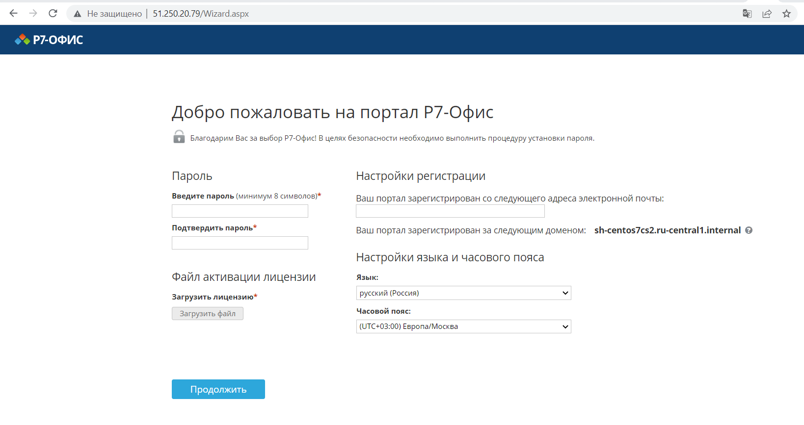
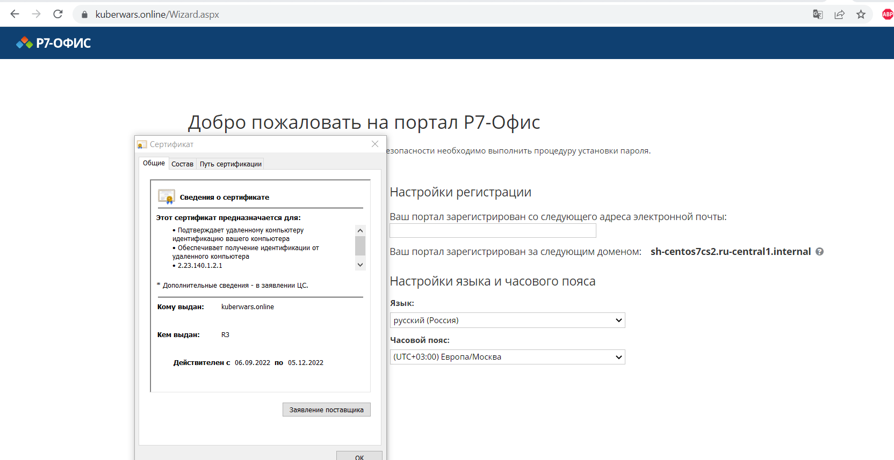

# Тестовые задания

## Подготовка к выполнению

1. Подключиться к vm по ssh через любой клиент (порт 2235 порт)

2. Установить пакет firewalld

<details> 
  <summary>[root@sh-centos7cs ~]# yum install firewalld </summary>

```bash 
[root@sh-centos7cs ~]# yum install firewalld

Loaded plugins: fastestmirror
Determining fastest mirrors
base                                                     | 3.6 kB     00:00
epel                                                     | 4.7 kB     00:00
extras                                                   | 2.9 kB     00:00
selectel-openstack                                       | 2.9 kB     00:00
updates                                                  | 2.9 kB     00:00
(1/6): epel/group_gz                                       |  97 kB   00:00
(2/6): epel/updateinfo                                     | 1.0 MB   00:00
(3/6): selectel-openstack/primary_db                       | 6.6 kB   00:00
(4/6): extras/primary_db                                   | 250 kB   00:00
(5/6): epel/primary_db                                     | 7.0 MB   00:00
(6/6): updates/primary_db                                  |  17 MB   00:00
Resolving Dependencies
--> Running transaction check
---> Package firewalld.noarch 0:0.6.3-13.el7_9 will be installed
--> Processing Dependency: python-firewall = 0.6.3-13.el7_9 for package: firewalld-0.6.3-13.el7_9.noarch
--> Processing Dependency: firewalld-filesystem = 0.6.3-13.el7_9 for package: firewalld-0.6.3-13.el7_9.noarch
--> Processing Dependency: ipset for package: firewalld-0.6.3-13.el7_9.noarch
--> Processing Dependency: ebtables for package: firewalld-0.6.3-13.el7_9.noarch
--> Running transaction check
---> Package ebtables.x86_64 0:2.0.10-16.el7 will be installed
---> Package firewalld-filesystem.noarch 0:0.6.3-13.el7_9 will be installed
---> Package ipset.x86_64 0:7.1-1.el7 will be installed
--> Processing Dependency: ipset-libs(x86-64) = 7.1-1.el7 for package: ipset-7.1-1.el7.x86_64
--> Processing Dependency: libipset.so.13(LIBIPSET_4.8)(64bit) for package: ipset-7.1-1.el7.x86_64
--> Processing Dependency: libipset.so.13(LIBIPSET_2.0)(64bit) for package: ipset-7.1-1.el7.x86_64
--> Processing Dependency: libipset.so.13()(64bit) for package: ipset-7.1-1.el7.x86_64
---> Package python-firewall.noarch 0:0.6.3-13.el7_9 will be installed
--> Processing Dependency: python-slip-dbus for package: python-firewall-0.6.3-13.el7_9.noarch
--> Running transaction check
---> Package ipset-libs.x86_64 0:7.1-1.el7 will be installed
---> Package python-slip-dbus.noarch 0:0.4.0-4.el7 will be installed
--> Processing Dependency: python-slip = 0.4.0-4.el7 for package: python-slip-dbus-0.4.0-4.el7.noarch
--> Running transaction check
---> Package python-slip.noarch 0:0.4.0-4.el7 will be installed
--> Finished Dependency Resolution

Dependencies Resolved

================================================================================
 Package                   Arch        Version               Repository    Size
================================================================================
Installing:
 firewalld                 noarch      0.6.3-13.el7_9        updates      449 k
Installing for dependencies:
 ebtables                  x86_64      2.0.10-16.el7         base         123 k
 firewalld-filesystem      noarch      0.6.3-13.el7_9        updates       51 k
 ipset                     x86_64      7.1-1.el7             base          39 k
 ipset-libs                x86_64      7.1-1.el7             base          64 k
 python-firewall           noarch      0.6.3-13.el7_9        updates      355 k
 python-slip               noarch      0.4.0-4.el7           base          31 k
 python-slip-dbus          noarch      0.4.0-4.el7           base          32 k

Transaction Summary
================================================================================
Install  1 Package (+7 Dependent packages)

Total download size: 1.1 M
Installed size: 4.5 M
Is this ok [y/d/N]: y
Downloading packages:
(1/8): ebtables-2.0.10-16.el7.x86_64.rpm                   | 123 kB   00:00
(2/8): ipset-libs-7.1-1.el7.x86_64.rpm                     |  64 kB   00:00
(3/8): firewalld-filesystem-0.6.3-13.el7_9.noarch.rpm      |  51 kB   00:00
(4/8): ipset-7.1-1.el7.x86_64.rpm                          |  39 kB   00:00
(5/8): firewalld-0.6.3-13.el7_9.noarch.rpm                 | 449 kB   00:00
(6/8): python-slip-dbus-0.4.0-4.el7.noarch.rpm             |  32 kB   00:00
(7/8): python-firewall-0.6.3-13.el7_9.noarch.rpm           | 355 kB   00:00
(8/8): python-slip-0.4.0-4.el7.noarch.rpm                  |  31 kB   00:00
--------------------------------------------------------------------------------
Total                                              7.4 MB/s | 1.1 MB  00:00
Running transaction check
Running transaction test
Transaction test succeeded
Running transaction
Warning: RPMDB altered outside of yum.
  Installing : ebtables-2.0.10-16.el7.x86_64                                1/8
  Installing : ipset-libs-7.1-1.el7.x86_64                                  2/8
  Installing : ipset-7.1-1.el7.x86_64                                       3/8
  Installing : python-slip-0.4.0-4.el7.noarch                               4/8
  Installing : python-slip-dbus-0.4.0-4.el7.noarch                          5/8
  Installing : python-firewall-0.6.3-13.el7_9.noarch                        6/8
  Installing : firewalld-filesystem-0.6.3-13.el7_9.noarch                   7/8
  Installing : firewalld-0.6.3-13.el7_9.noarch                              8/8
  Verifying  : ipset-7.1-1.el7.x86_64                                       1/8
  Verifying  : python-slip-dbus-0.4.0-4.el7.noarch                          2/8
  Verifying  : firewalld-filesystem-0.6.3-13.el7_9.noarch                   3/8
  Verifying  : firewalld-0.6.3-13.el7_9.noarch                              4/8
  Verifying  : python-slip-0.4.0-4.el7.noarch                               5/8
  Verifying  : python-firewall-0.6.3-13.el7_9.noarch                        6/8
  Verifying  : ipset-libs-7.1-1.el7.x86_64                                  7/8
  Verifying  : ebtables-2.0.10-16.el7.x86_64                                8/8

Installed:
  firewalld.noarch 0:0.6.3-13.el7_9

Dependency Installed:
  ebtables.x86_64 0:2.0.10-16.el7
  firewalld-filesystem.noarch 0:0.6.3-13.el7_9
  ipset.x86_64 0:7.1-1.el7
  ipset-libs.x86_64 0:7.1-1.el7
  python-firewall.noarch 0:0.6.3-13.el7_9
  python-slip.noarch 0:0.4.0-4.el7
  python-slip-dbus.noarch 0:0.4.0-4.el7

Complete!
```

</details>

#### При работе ssh через порт 2235 необходимо перед стартом firewalld настроить его, иначе грозит потерей доступа!!!

3. Запустим firewalld и добавим в автозагрузку при старте ОС.

```bash
[root@sh-centos7cs ~]# systemctl enable firewalld.service
[root@sh-centos7cs ~]# systemctl start firewalld.service
```

4. Проверим статус сервиса firewalld.

```bash
[root@sh-centos7cs2 sid]# systemctl status firewalld

● firewalld.service - firewalld - dynamic firewall daemon
   Loaded: loaded (/usr/lib/systemd/system/firewalld.service; enabled; vendor preset: enabled)
   Active: active (running) since Mon 2022-09-05 18:37:58 UTC; 1min 5s ago
     Docs: man:firewalld(1)
 Main PID: 7832 (firewalld)
   CGroup: /system.slice/firewalld.service
           └─7832 /usr/bin/python2 -Es /usr/sbin/firewalld --nofork --nopid

Sep 05 18:37:57 sh-centos7cs2.ru-central1.internal systemd[1]: Starting firew...
Sep 05 18:37:58 sh-centos7cs2.ru-central1.internal systemd[1]: Started firewa...
Sep 05 18:37:58 sh-centos7cs2.ru-central1.internal firewalld[7832]: WARNING: ...
Hint: Some lines were ellipsized, use -l to show in full.
```

## Задание 1.1

Установить Community Server на предоставленную ВМ.

## Решение задания 1.1

1. Версия Centos + просмотр версии ядра Linux

```bash 
[root@sh-centos7cs ~]# cat /etc/centos-release
CentOS Linux release 7.9.2009 (Core)
[root@sh-centos7cs ~]# uname -r
3.10.0-1160.53.1.el7.x86_64
```

2. Текущая версия Python

```bash 
[root@sh-centos7cs ~]# python -V
Python 2.7.5

[root@sh-centos7cs ~]# python3 --version
Python 3.6.8
```

3. Скачиваем файл скрипта Р7-Офис. Сервер. Профессиональный для CentOS

```bash 
[root@sh-centos7cs ~]# wget https://download.r7-office.ru/repo/install-RedHat.sh

--2022-09-05 19:50:24--  https://download.r7-office.ru/repo/install-RedHat.sh
Resolving download.r7-office.ru (download.r7-office.ru)... 5.178.85.228
Connecting to download.r7-office.ru (download.r7-office.ru)|5.178.85.228|:443... connected.
HTTP request sent, awaiting response... 200 OK
Length: 3210 (3.1K) [application/x-sh]
Saving to: ‘install-RedHat.sh’

100%[======================================>] 3,210       --.-K/s   in 0s

2022-09-05 19:50:24 (499 MB/s) - ‘install-RedHat.sh’ saved [3210/3210]
```

4. Установим все компоненты и модули Р7-Офис. Сервер. Профессиональный
Требуется более 40Гб свободного места на диске!
При установке одному скрипту понадобилась версия Python 3.7 и выше!

```bash 
[root@sh-centos7cs2 sid]# bash install-RedHat.sh

................................................

Trying to establish MySQL connection... OK
Restarting services...
r7-officeJabber.service
OK
6144+0 records in
6144+0 records out
6442450944 bytes (6.4 GB) copied, 54.754 s, 118 MB/s
Setting up swapspace version 1, size = 6291452 KiB
no label, UUID=3122a50b-070c-4c17-8b75-5255ba2cfdb2
firewalld-0.6.3-13.el7_9.noarch
success
success

Спасибо за инсталляцию Р7-Офис. Сервер
Вы можете сконфигурировать ваш портал используя Р7-Офис. Панель управления.
Если у вас есть какие-либо вопросы вы можете связаться с нами через http://wwww.r7-office.ru
```

5. Проверим работу Р7-Офис через браузер



---

## Задание 1.2

Перевести портал на https, добавив самоподписной сертификат. 

## Решение задания 1.2

1.  Создадим сертификат, подписанный Центром Сертификации letsencrypt и переключим портал на протокол HTTPS

```bash 
[root@sh-centos7cs2 sid]# bash /var/www/r7-office/Tools/letsencrypt.sh kuberwars.online
Saving debug log to /var/log/letsencrypt/letsencrypt.log
Account registered.
Requesting a certificate for kuberwars.online

Successfully received certificate.
Certificate is saved at: /etc/letsencrypt/live/kuberwars.online/fullchain.pem
Key is saved at:         /etc/letsencrypt/live/kuberwars.online/privkey.pem
This certificate expires on 2022-12-05.
These files will be updated when the certificate renews.
Certbot has set up a scheduled task to automatically renew this certificate in the background.

- - - - - - - - - - - - - - - - - - - - - - - - - - - - - - - - - - - - - - - -
If you like Certbot, please consider supporting our work by:
 * Donating to ISRG / Let's Encrypt:   https://letsencrypt.org/donate
 * Donating to EFF:                    https://eff.org/donate-le
- - - - - - - - - - - - - - - - - - - - - - - - - - - - - - - - - - - - - - - -
Generating DH parameters, 2048 bit long safe prime, generator 2
This is going to take a long time
.........................+.........+.................................++*++*
```

2. Проверим сертификат для сервера Р7-Офис через браузер



---

## Задание 1.3

Добавить и настроить nginx в качестве реверс прокси.

## Решение задания 1.3

1. Похоже что реверс прокси сконфигурирован из коробки

<details> 
  <summary>root@sh-centos7cs2 conf.d]# cat /etc/nginx/conf.d/r7-office.conf </summary>

```bash 
root@sh-centos7cs2 conf.d]# cat /etc/nginx/conf.d/r7-office.conf
upstream fastcgi_backend_apisystem {
        server unix:/var/run/r7-office/r7-officeApiSystem.socket;
        keepalive 32;
}

upstream fastcgi_backend {
        server unix:/var/run/r7-office/r7-office.socket;
        keepalive 64;
}

fastcgi_cache_path /var/cache/nginx/r7-office
        levels=1:2
        keys_zone=r7-office:256m
        max_size=1024m
        inactive=1d;

geo $ip_external {
     default 1;
     127.0.0.1 0;
}

map $http_host $this_host {
  "" $host;
  default $http_host;
}

map $http_x_forwarded_proto $the_scheme {
  default $http_x_forwarded_proto;
  "" $scheme;
}

map $http_x_forwarded_host $the_host {
  default $http_x_forwarded_host;
  "" $this_host;
}

map $request_uri $header_access_control_allow_origin {
  ~*^/(api\/2.0|products\/crm\/httphandlers\/webtoleadfromhandler.ashx|products\/files\/httphandlers\/filehandler.ashx|products\/files\/chunkeduploader.ashx|thirdparty\/plugin) "*";
  default "";
}

map $request_uri $header_x_frame_options {
  ~*^/(favicon\.ico|products\/files\/share\.aspx|products\/files\/saveas\.aspx|products\/files\/filechoice\.aspx|products\/files\/doceditor\.aspx|thirdparty\/plugin) "";
  default "SAMEORIGIN";
}

server {
        listen 0.0.0.0:80 default_server;
        listen [::]:80;

        server_name _;
        server_tokens off;

        root /nowhere; ## root doesn't have to be a valid path since we are redirecting

        location / {
                if ($ip_external) {
                                ## Redirects all traffic to the HTTPS host
                                 rewrite ^ https://$host$request_uri? permanent;
                        }

                        client_max_body_size 100m;

                        proxy_pass https://127.0.0.1;
                        proxy_http_version 1.1;
                        proxy_set_header Upgrade $http_upgrade;
                        proxy_set_header Connection "upgrade";
                        proxy_set_header Host $host;
                        proxy_set_header X-Real-IP $remote_addr;
                        proxy_set_header X-Forwarded-For $proxy_add_x_forwarded_for;
                        proxy_set_header X-Forwarded-Host $server_name;
                        proxy_set_header X-Forwarded-Proto $scheme;
                        proxy_ssl_verify off;
        }
}

server {
        listen 0.0.0.0:443 ssl http2;
        listen [::]:443 ssl http2 default_server;

        charset utf-8;

        server_tokens off;

        ## Increase this if you want to upload large attachments
        client_max_body_size 100m;

        ssl_certificate /var/www/r7-office/Data/certs/r7-office.crt;
        ssl_certificate_key /var/www/r7-office/Data/certs/r7-office.key;
        ssl_verify_client off;
    ssl_session_timeout 1d;
    ssl_session_cache shared:MozSSL:10m;  # about 40000 sessions
    ssl_session_tickets off;

        ssl_protocols TLSv1.2;
    ssl_ciphers ECDHE-ECDSA-AES128-GCM-SHA256:ECDHE-RSA-AES128-GCM-SHA256:ECDHE-ECDSA-AES256-GCM-SHA384:ECDHE-RSA-AES256-GCM-SHA384:ECDHE-ECDSA-CHACHA20-POLY1305:ECDHE-RSA-CHACHA20-POLY1305:DHE-RSA-AES128-GCM-SHA256:DHE-RSA-AES256-GCM-SHA384;
        ssl_prefer_server_ciphers off;

        add_header Strict-Transport-Security "max-age=63072000; includeSubDomains; preload" always;
    add_header X-Frame-Options $header_x_frame_options;
        add_header X-Content-Type-Options nosniff;
        add_header Access-Control-Allow-Origin $header_access_control_allow_origin;

        ssl_stapling on;
        ssl_stapling_verify on;
        ssl_trusted_certificate /var/www/r7-office/Data/certs/stapling.trusted.crt;
        resolver 8.8.8.8 8.8.4.4 127.0.0.11 valid=300s; # Can change to your DNS resolver if desired
        resolver_timeout 10s;

        ssl_dhparam /var/www/r7-office/Data/certs/dhparam.pem;

        large_client_header_buffers 4 16k;

        set $X_REWRITER_URL $the_scheme://$the_host;

        if ($http_x_rewriter_url != '') {
                set $X_REWRITER_URL $http_x_rewriter_url ;
        }

    include /etc/nginx/includes/r7-office-communityserver-*.conf;
}
```

</details>

---

## Задание 1.4

Настроить репликацию бд mysql master - slave.

## Решение задания 1.4

1. Вносим правки в my.cnf на основном сервере. 

```bash
[root@sh-centos7cs2 ~]# sudo vi /etc/my.cnf
```

---

### Ссылки

1. Ссылка на установку серверной версии Р7-Офис. Сервер. Профессиональный с помощью скрипта для CentOS: https://support.r7-office.ru/https@support.r7-office.ru/hc/ru/articles/4650839521948-_25D0_25A3_25D1_2581_25D1_2582_25D0_25B0_25D0_25BD_25D0_25BE_25D0_25B2_25D0_25BA_25D0_0C83026324.html              
2. Ссылка на переключение Р7-Офис. Сервер. Профессиональный на протокол HTTPS с помощью собственного сертификата: https://support.r7-office.ru/https@support.r7-office.ru/hc/ru/articles/4650866011804-_25D0_259A_25D0_25B0_25D0_25BA-_25D0_25BF_25D0_25B5_25D1_2580_25D0_25B5_25D0_25BA_25D001E0E1DD9D.html        
3. Ссылка на переход на HTTPS с помощью скрипта: https://support.r7-office.ru/https@support.r7-office.ru/hc/ru/articles/4650840176028/default.htm

---